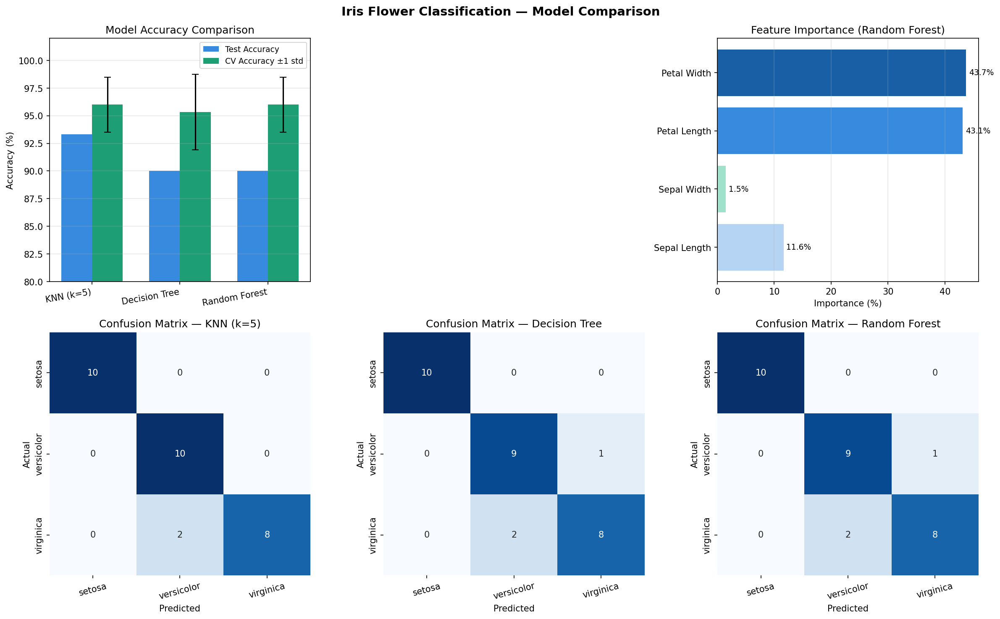
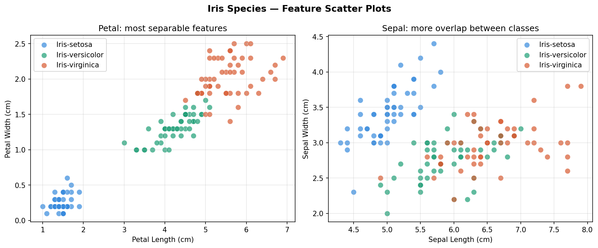

# CodeAlpha_IrisFlowerClassification
project_1

# 🌸 Iris Flower Classification
### CodeAlpha Data Science Internship — Task 1

##  Project Overview

This project builds and compares **three machine learning classification models** to identify Iris flower species based on physical measurements. The dataset contains 150 samples from three species — *Iris setosa*, *Iris versicolor*, and *Iris virginica* - each described by four features: sepal length, sepal width, petal length, and petal width.

##  Project Structure

CodeAlpha_IrisFlowerClassification/
│
├── iris_classification.py   # Main Python script
├── Iris.csv                     # Dataset (150 samples)
├── iris_results.png             # Model performance dashboard
├── iris_scatter.png             # Feature scatter plots
└── README.md                    # This file

## 🤖 Models Used

### 1. K-Nearest Neighbors (KNN)
- Classifies a new point by looking at its **5 nearest neighbors** in the training data
- Simple, non-parametric, distance-based algorithm
- Requires feature scaling (StandardScaler applied)

### 2. Decision Tree
- Learns a series of **if-then rules** on feature values
- Most interpretable model — logic can be read directly
- `max_depth=4` used to prevent overfitting

### 3. Random Forest
- An **ensemble of 100 decision trees** that vote together
- Each tree sees a random subset of data and features
- Most robust model — individual errors cancel out

## 📈 Results

| Model | Test Accuracy | CV Accuracy (5-fold) |

| KNN (k=5) | 93.33% | 96.00% ± 2.49% |
| Decision Tree | 93.33% | 95.33% ± 3.40% |
| **Random Forest** | **90.00%** | **96.67% ± 2.11%** |

> **Best model: Random Forest** — highest cross-validation accuracy (96.7%) with lowest variance (±2.1%), meaning it generalises best to unseen data.

### Performance Dashboard

### Feature Scatter Plots

## How to Run

### 1. Install dependencies
pip install numpy pandas matplotlib seaborn scikit-learn

### 2. Run the script
python iris_classification.py

##  Libraries Used

| Library | Purpose |

| `pandas` | Loading and exploring the CSV dataset |
| `numpy` | Numerical operations and array handling |
| `matplotlib` | Creating charts and saving figures |
| `seaborn` | Heatmaps for confusion matrices |
| `scikit-learn` | Preprocessing, model training, and evaluation |

